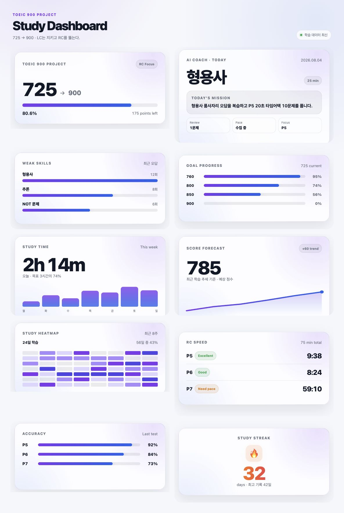
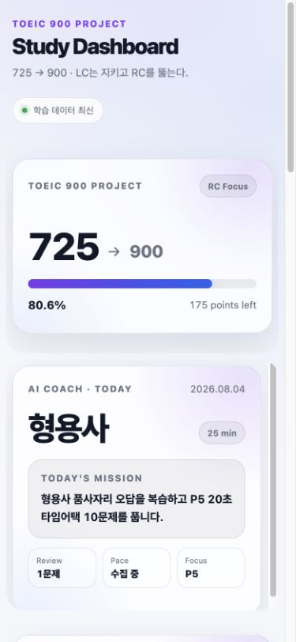

# TOEIC Widgets — Sprint 1 Summary

Completed: 2026-08-04

## Outcome

Sprint 1 is complete. The approved landing/dashboard design was preserved while the project was moved to the requested root-level architecture, audited, consolidated into named reusable components, and verified as a production static site. Hero, Coach, and Weak Skills were rebuilt against the shared component and JSON data contracts.

## Completed tasks

- Audited the full repository and added `REPORT.md` with structure, duplication, link, usage, and improvement findings.
- Moved the deployable application from `public/` to root-level `assets/`, `data/`, `widgets/`, `index.html`, and `dashboard.html` paths.
- Preserved all ten existing widget data files so no previously working widget became orphaned.
- Updated GitHub Pages packaging and future data-refresh paths for the root architecture.
- Added `npm run site:check` to validate local references, required shared assets, JSON contracts, and the prohibition on inline CSS/JavaScript.
- Formalized reusable `Card`, `Progress`, `Badge`, `Chip`, `Button`, and `Header` components without changing the approved visual tokens.
- Rebuilt Hero with shared components and `data/hero.json`.
- Rebuilt Coach with shared components and `data/coach.json`.
- Rebuilt Weak Skills as a semantic ordered list with shared components and `data/skills.json`.
- Verified automatic dark-mode and reduced-motion media rules.
- Verified desktop two-column and mobile one-column layouts with no horizontal overflow.
- Verified every required URL over HTTP and in a browser with no widget error state.

## Screenshots

### Desktop dashboard — 1200 × 900 viewport



### Mobile dashboard — 390 × 844 viewport



## Final folder tree

```text
.
├── .github/
│   └── workflows/
│       ├── deploy.yml
│       └── update-data.yml
├── assets/
│   ├── css/
│   │   ├── theme.css
│   │   ├── layout.css
│   │   └── components.css
│   └── js/
│       ├── common.js
│       └── animation.js
├── data/
│   ├── accuracy.json
│   ├── coach.json
│   ├── forecast.json
│   ├── goals.json
│   ├── heatmap.json
│   ├── hero.json
│   ├── rc-speed.json
│   ├── skills.json
│   ├── streak.json
│   └── study.json
├── docs/
│   └── screenshots/
│       ├── sprint1-dashboard-desktop.jpg
│       └── sprint1-dashboard-mobile.jpg
├── scripts/
│   ├── build-json.js
│   ├── check-site.js
│   ├── fetch-notion.js
│   └── update-dashboard.js
├── widgets/
│   ├── accuracy.html
│   ├── coach.html
│   ├── forecast.html
│   ├── goals.html
│   ├── heatmap.html
│   ├── hero.html
│   ├── rc-speed.html
│   ├── streak.html
│   ├── study-time.html
│   └── weak-skills.html
├── dashboard.html
├── index.html
├── README.md
├── REPORT.md
├── SPRINT1_SUMMARY.md
└── package.json
```

## Changed files

### Added

- `REPORT.md`
- `SPRINT1_SUMMARY.md`
- `docs/screenshots/sprint1-dashboard-desktop.jpg`
- `docs/screenshots/sprint1-dashboard-mobile.jpg`
- `scripts/check-site.js`

### Moved from `public/` to the repository root

- `index.html`
- `dashboard.html`
- `assets/css/theme.css`
- `assets/css/layout.css`
- `assets/css/components.css`
- `assets/js/common.js`
- `assets/js/animation.js`
- `widgets/hero.html`
- `widgets/coach.html`
- `widgets/weak-skills.html`
- `widgets/study-time.html`
- `widgets/goals.html`
- `widgets/forecast.html`
- `widgets/heatmap.html`
- `widgets/accuracy.html`
- `widgets/rc-speed.html`
- `widgets/streak.html`
- `data/hero.json`
- `data/coach.json`
- `data/skills.json`
- `data/study.json`
- `data/goals.json`
- `data/forecast.json`
- `data/heatmap.json`
- `data/accuracy.json`
- `data/rc-speed.json`
- `data/streak.json`

### Modified

- `.github/workflows/deploy.yml`
- `.github/workflows/update-data.yml`
- `.gitignore`
- `README.md`
- `package.json`
- `scripts/build-json.js`
- `scripts/update-dashboard.js`
- `assets/css/components.css`
- `widgets/hero.html`
- `widgets/coach.html`
- `widgets/weak-skills.html`
- `widgets/study-time.html`
- `widgets/goals.html`
- `widgets/forecast.html`
- `widgets/heatmap.html`
- `widgets/accuracy.html`
- `widgets/rc-speed.html`
- `widgets/streak.html`

## Sprint commits

| Commit | Change |
|---|---|
| `516bc44` | `docs: analyze repository` |
| `f48220a` | `refactor: create widget architecture` |
| `5131bae` | `refactor: shared design system` |
| `312de75` | `feat: rebuild hero widget` |
| `9e03bcb` | `feat: rebuild coach widget` |
| `83169b8` | `feat: rebuild weak skills widget` |
| `8b9c214` | `docs: add Sprint 1 summary` |

## Required URL verification

| URL | HTTP | Browser result |
|---|---:|---|
| `/index.html` | 200 | Pass; redirects to `/dashboard.html` |
| `/dashboard.html` | 200 | Pass; 10 widget frames |
| `/widgets/hero.html` | 200 | Pass; JSON loaded, no error state |
| `/widgets/coach.html` | 200 | Pass; JSON loaded, no error state |
| `/widgets/weak-skills.html` | 200 | Pass; JSON loaded, no error state |
| `/widgets/study-time.html` | 200 | Pass; JSON loaded, no error state |
| `/widgets/goals.html` | 200 | Pass; JSON loaded, no error state |
| `/widgets/forecast.html` | 200 | Pass; JSON loaded, no error state |
| `/widgets/heatmap.html` | 200 | Pass; JSON loaded, no error state |
| `/widgets/accuracy.html` | 200 | Pass; JSON loaded, no error state |
| `/widgets/rc-speed.html` | 200 | Pass; JSON loaded, no error state |
| `/widgets/streak.html` | 200 | Pass; JSON loaded, no error state |

## Validation performed

```bash
npm run site:check
npm run data:check
node --check assets/js/common.js
node --check assets/js/animation.js
node --check scripts/check-site.js
node --check scripts/build-json.js
node --check scripts/fetch-notion.js
node --check scripts/update-dashboard.js
```

Both GitHub Actions workflow files were also parsed as YAML, and the complete dashboard was rendered at desktop and mobile breakpoints.

## Remaining TODOs for Sprint 2

- Rebuild Study Time, Goals, Forecast, Heatmap, Accuracy, RC Speed, and Streak as feature-level passes using the finalized component vocabulary.
- Add nested JSON schema validation for every repeated item, not only top-level fields.
- Add fixture-based tests for loading, malformed JSON, empty data, and network failure states.
- Add automated visual regression coverage for desktop/mobile and light/dark modes.
- Define versioned normalized data contracts before implementing the Notion adapter.
- Implement Notion pagination, rate-limit handling, retries, and schema mapping only after those contracts and fixtures are approved.
- Review iframe intrinsic heights and loading strategy as content becomes dynamic to prevent clipping with longer Notion-generated copy.
