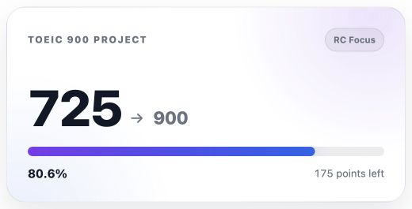
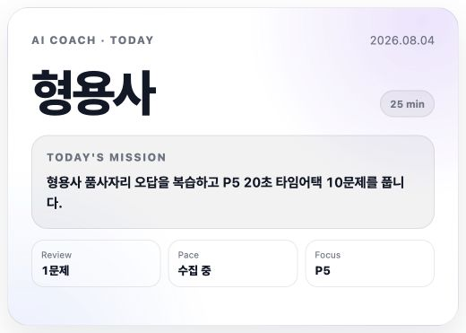
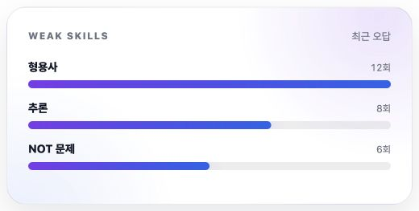
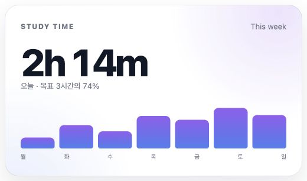
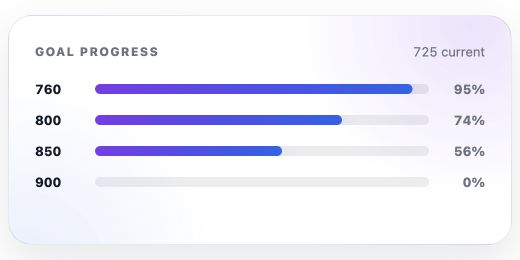
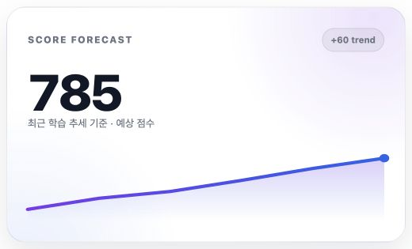
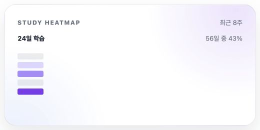
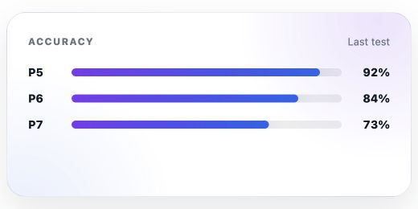
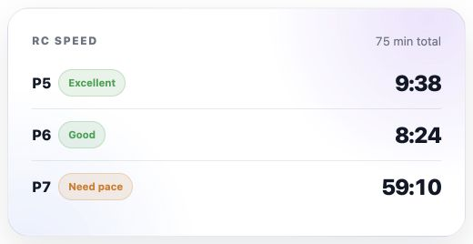
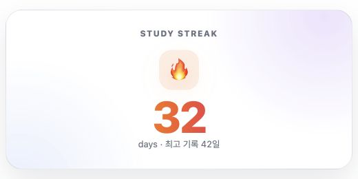

# TOEIC Widgets

Production embed reference for the TOEIC Widgets collection.

Base URL: `https://allie1231.github.io/toeic-widgets`

## Embed in Notion

1. Copy the full widget URL from this guide.
2. In Notion, type `/embed` and choose **Embed**.
3. Paste the URL and select **Embed link**.
4. Resize the block to the recommended dimensions below.

Each widget currently reads its data from a versioned JSON file in `/data`. The future API routes listed below are reserved for the planned Notion automation layer and are not active yet.

## Hero Progress

- URL: `https://allie1231.github.io/toeic-widgets/widgets/hero.html`
- Path: `/widgets/hero.html`
- Recommended size: `520 × 265 px`
- Data: `/data/hero.json`
- Future API endpoint: `/api/widgets/hero`
- Embed: Notion Embed block

## AI Coach

- URL: `https://allie1231.github.io/toeic-widgets/widgets/coach.html`
- Path: `/widgets/coach.html`
- Recommended size: `520 × 371 px`
- Data: `/data/coach.json`
- Future API endpoint: `/api/widgets/coach`
- Embed: Notion Embed block

## Weak Skills

- URL: `https://allie1231.github.io/toeic-widgets/widgets/weak-skills.html`
- Path: `/widgets/weak-skills.html`
- Recommended size: `520 × 263 px`
- Data: `/data/skills.json`
- Future API endpoint: `/api/widgets/weak-skills`
- Embed: Notion Embed block

## Study Time

- URL: `https://allie1231.github.io/toeic-widgets/widgets/study-time.html`
- Path: `/widgets/study-time.html`
- Recommended size: `520 × 306 px`
- Data: `/data/study.json`
- Future API endpoint: `/api/widgets/study-time`
- Embed: Notion Embed block

## Goals

- URL: `https://allie1231.github.io/toeic-widgets/widgets/goals.html`
- Path: `/widgets/goals.html`
- Recommended size: `520 × 260 px`
- Data: `/data/goals.json`
- Future API endpoint: `/api/widgets/goals`
- Embed: Notion Embed block

## Forecast

- URL: `https://allie1231.github.io/toeic-widgets/widgets/forecast.html`
- Path: `/widgets/forecast.html`
- Recommended size: `520 × 315 px`
- Data: `/data/forecast.json`
- Future API endpoint: `/api/widgets/forecast`
- Embed: Notion Embed block

## Heatmap

- URL: `https://allie1231.github.io/toeic-widgets/widgets/heatmap.html`
- Path: `/widgets/heatmap.html`
- Recommended size: `520 × 260 px`
- Data: `/data/heatmap.json`
- Future API endpoint: `/api/widgets/heatmap`
- Embed: Notion Embed block

## Accuracy

- URL: `https://allie1231.github.io/toeic-widgets/widgets/accuracy.html`
- Path: `/widgets/accuracy.html`
- Recommended size: `520 × 260 px`
- Data: `/data/accuracy.json`
- Future API endpoint: `/api/widgets/accuracy`
- Embed: Notion Embed block

## RC Speed

- URL: `https://allie1231.github.io/toeic-widgets/widgets/rc-speed.html`
- Path: `/widgets/rc-speed.html`
- Recommended size: `520 × 268 px`
- Data: `/data/rc-speed.json`
- Future API endpoint: `/api/widgets/rc-speed`
- Embed: Notion Embed block

## Streak

- URL: `https://allie1231.github.io/toeic-widgets/widgets/streak.html`
- Path: `/widgets/streak.html`
- Recommended size: `520 × 260 px`
- Data: `/data/streak.json`
- Future API endpoint: `/api/widgets/streak`
- Embed: Notion Embed block

## Data and caching

Widget data is fetched with `cache: no-store` so newly generated JSON is picked up without a stale browser cache. GitHub Pages serves the static JSON today; the prepared scripts and workflow can replace it with Notion-generated data in a later sprint.
